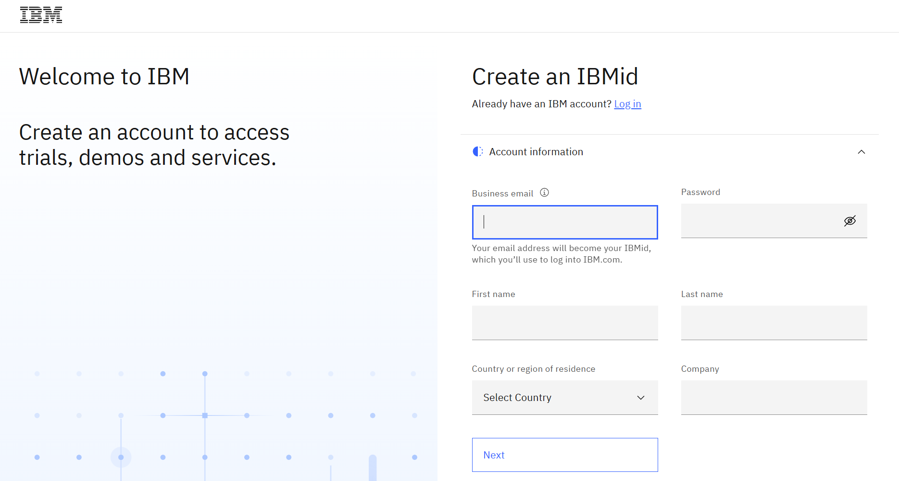
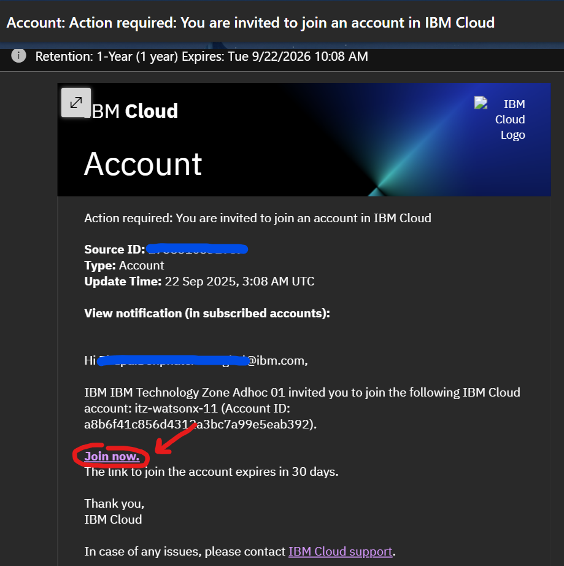
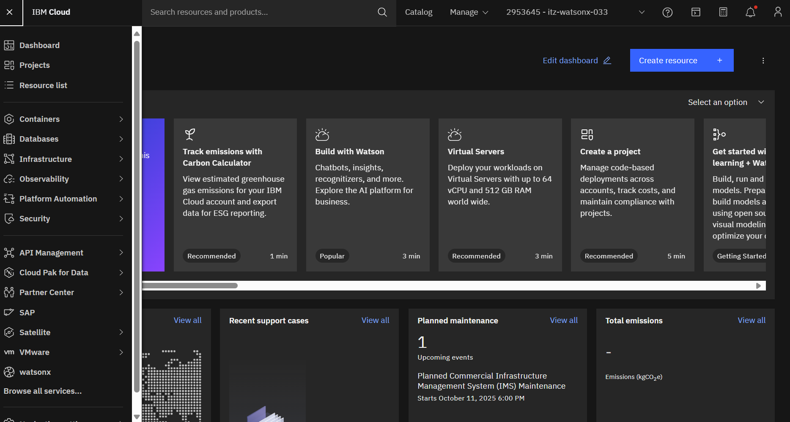
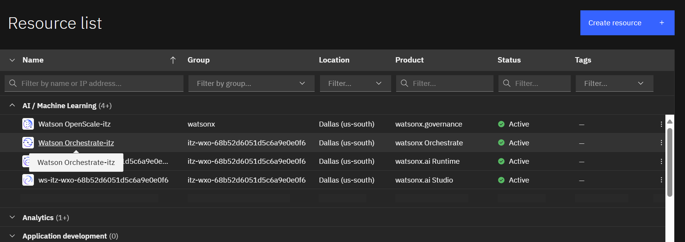

# Set Up

This guide provides step-by-step instructions to set up your development environment and configure **watsonx Orchestrate** for the lab:

### No code lab
1. IBMid registration
2. Join Watsonx Orchestrate Environment

### Low code lab
1. Install VS Code 
2. Install Python 3.11 
3. Install dependencies
4. Register and provision a watsonx Orchestrate free trial
5. Activate your watsonx Orchestrate environment 
6. Set up third-party models

# No Code Lab

## 1. IBMid registration
1.1 Navigate to Sign up for [My IBM account page](https://www.ibm.com/account/reg/us-en/signup?formid=urx-19776). The Create your IBM account page opens.



1.2 Fill the required fields present in the Account information section and click Next.

1.3 The email address that you specify in the form is your user name or IBMid.

1.4 Enter the verification code to verify your email ID and click Create account. The IBMid multi-factor authentication enrollment page opens.

1.5 Select your preferred verification method. When completed, the user account is created.

## 2. Join Watsonx Orchestrate Environment

### Step 2.1: Check Your Email Invitation
You will receive an IBM Cloud account invitation email from the instructor similar to this:



### Step 2.2: Accept the Invitation
1. **Check your notification:** Look for the message "Action required: You are invited to join an account in IBM Cloud"
2. **Review invitation details:**
   - **Source ID:** Your invitation identifier
   - **Type:** Account invitation
   - **Update Time:** When the invitation was sent
   - **Account:** `itZ-watsonx-11` (or similar watsonx account)

### Step 2.3: Join the Account
1. Click the **"Join now"** button in the email
2. You have **30 days** to accept the invitation before it expires

### Step 2.4: 🚀 Access watsonx Orchestrate from IBM Cloud Dashboard
After joining the account, you'll be taken to the IBM Cloud dashboard:

1. **Navigate to Resources:** Click **"Resource list"** on the left sidebar



> **Important:** Make sure the instance number displayed in the top right corner matches the instructor's instance number.

2. **Launch watsonx Orchestrate:** 
   - Navigate to the **AI/Machine Learning** section
   - Find and click on **watsonx Orchestrate** to launch the service



### Step 2.5: ✅ Complete Access Setup
You now have access to the watsonx Orchestrate environment and can begin working with the platform for your lab activities.


# Low Code Lab
## 1. Installing VS code (Only for the coding lab)
Here is the link to download VS code
https://code.visualstudio.com/download

## 2. Installing Python 3.11

Before proceeding, ensure you have Python 3.11 installed on your system.

#### On Ubuntu/Linux:
```
sudo apt update
sudo apt install python3.11 python3.11-venv python3.11-distutils
```

#### On Windows:
1. Download the Python 3.11 installer from the [official Python website](https://www.python.org/downloads/release/python-3110/).
2. Run the installer and follow the prompts. Make sure to check "Add Python to PATH" during installation.

#### Verify installation:

##### Mac
```
python3.11 --version
```
You should see output similar to: `Python 3.11.x`

##### Windows

```
py -3.11 --version
```


## 3. Install dependencies
Install and create a virtual environment from `requirement.txt`. Ensure your python version is 3.11

Run the following command

#### Mac
```
python3.11 -m venv venv
source venv/bin/activate
pip install -r requirement.txt
```

#### Windows (Powershell)
```
py -3.11 -m venv venv
venv\Scripts\activate
pip install -r requirement.txt
```


## 4. Registering and Provisioning watsonx Orchestrate Free Trial

### Step 4.1: Access Registration Page
1. Navigate to the [watsonx Orchestrate product page](https://www.ibm.com/products/watsonx-orchestrate)
2. Click **"Try it for free"**


### Step 4.2: Complete Registration Form
Fill in your personal information to create your account:


> 💡 **Tip:** You can use your personal email address for registration

### Step 4.3: Email Verification
Check your email for the verification code:


### Step 4.4: Enter Verification Code
Input the verification code to activate your free trial:


### Step 4.5: Deploy Trial Instance
1. Select **`us-east`** region for deployment
2. Confirm your deployment settings


### Step 4.6: Access Your Instance
1. You'll be redirected to: https://dl.watson-orchestrate.ibm.com/
2. Login using your IBMid and password


### Step 4.7: ✅ Successful Provisioning
Your watsonx Orchestrate instance is ready when you see this dashboard:


<!-- ### Incase you cant run your script Make sure the scripts executable (run this once):

#### For Linux/macOS:
```bash
chmod +x import_all.sh
```

#### For Windows (PowerShell):
Open PowerShell and run:
```powershell
Set-ExecutionPolicy -ExecutionPolicy RemoteSigned -Scope CurrentUser
Unblock-File -Path .\import_all.ps1
```

Then run the script:
```powershell
./import_all.ps1
``` -->


## 5. Activating watsonx Orchestrate environment
Assuming your are running watsonx Orchestrate on AWS Cloud (Saas),
Please get your credentials from 
```
orchestrate env list
orchestrate env add -n trial-env -u <Service instance URL>
orchestrate env activate trial-env
(Then enter API Key)
```

Alternatively,
```orchestrate env activate trial-env --api-key <your_APIKEY>```


https://developer.watson-orchestrate.ibm.com/environment/production_import


## 6. 🤖 Setup Third Party Model (Gemini Integration)

### Overview
To enhance Thai language performance, watsonx Orchestrate supports external models via the **AI Gateway**. 
In this lab, we'll integrate `google/gemini-2.5-flash` for superior multilingual capabilities.

📖 **Learn more:** [Managing LLMs Documentation](https://developer.watson-orchestrate.ibm.com/llm/managing_llm)

---

### Step 6.1: Create Connection in watsonx Orchestrate
1. Navigate to the **Connections** tab in watsonx Orchestrate
2. Add a new connection named `gg_creds_UI`


### Step 6.2: Configure API Credentials
For **both draft and live environments**, add the following key-value pair:
- **Key:** `api_key`
- **Value:** `<your_GOOGLE_API_KEY>`


> 🔑 **API Key:** We will provide the `GOOGLE_API_KEY` during the workshop
> 
> 💡 **Alternative:** You can obtain your own API key from [Google AI Studio](https://aistudio.google.com)

### Step 6.3: Add Model via CLI
Run the following command in your terminal:

```bash
orchestrate models add --name google/gemini-2.5-flash --app-id gg_creds_UI
```

### Step 6.4: ✅ Verify Integration
Successful integration will show:


---

🎉 **Congratulations!** Your watsonx Orchestrate environment is now configured with Gemini 2.5 Flash for enhanced Thai language support.

