# Classroom Behavior Monitoring Agent

This guide shows how to create a classroom behavior monitoring agent using Watsonx Orchestrate.

## Step 1: Access Watsonx Orchestrate Builder

Go to [Watsonx Orchestrate Builder](https://orchestrate.ibm.com)

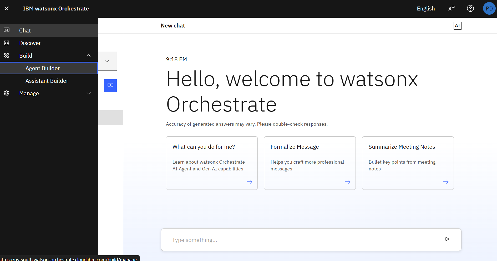

## Step 2: Create New Agent

1. Click **"Create New Agent"** button

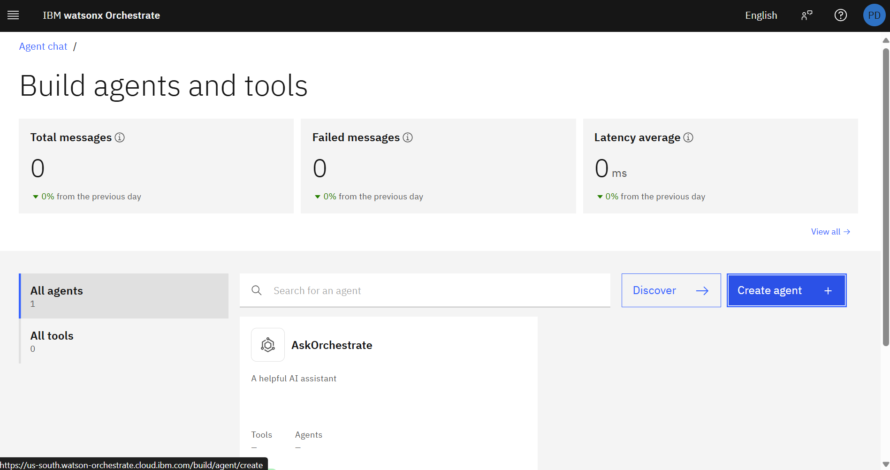

## Step 3: Configure Agent Settings

1. Choose **"Create from scratch"**
2. Enter agent details:
   - **Agent Name:** `Classroom Behavior Record Agent`
   - **Description:** `An AI agent that helps teachers record and monitor student behavior observations, track behavior patterns, and manage classroom notes efficiently.`

## Step 4: Create Agent

1. Click **"Create"** to proceed with agent creation

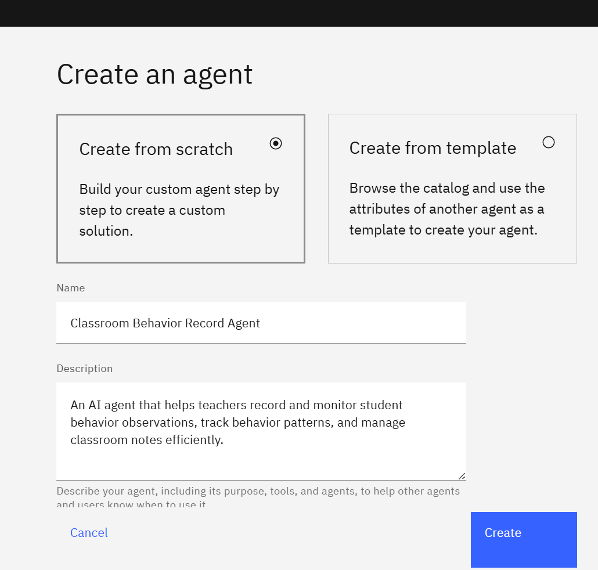

## Step 5: Add Tools to Agent

1. Navigate to **"Toolset"** section
2. Click **"Add Tool"** button

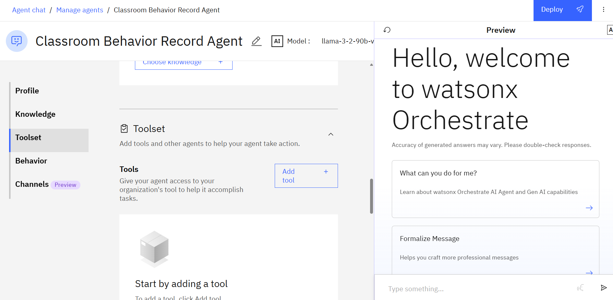

> **Note:** The AI model displayed may vary based on your configuration. If you have previously imported Gemini, it will show "Gemini 2.5 Flash" instead of the default model.

## Step 6: Import API Tools

1. Click **"Add from file or MCP server"**

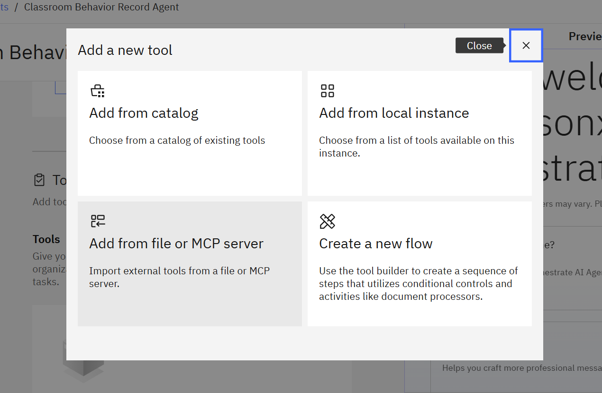

2. Select **"Import from file"**

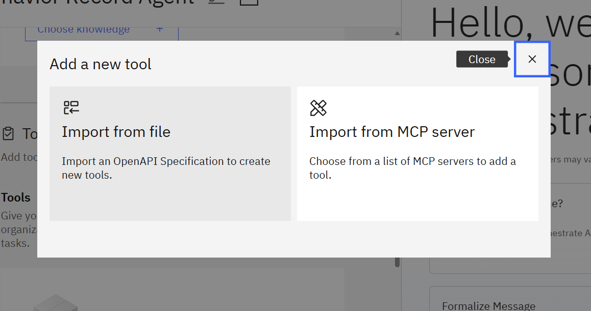

## Step 7: Upload OpenAPI Configuration

1. Upload the `class_notes_openapi.json` file from:
   ```
   WXO-Saint-Gabriel-workshop/LAB_01_CLASSROOM_BEHAVIOR_MONITORING_AGENT/UI/open_api_tools/
   ```

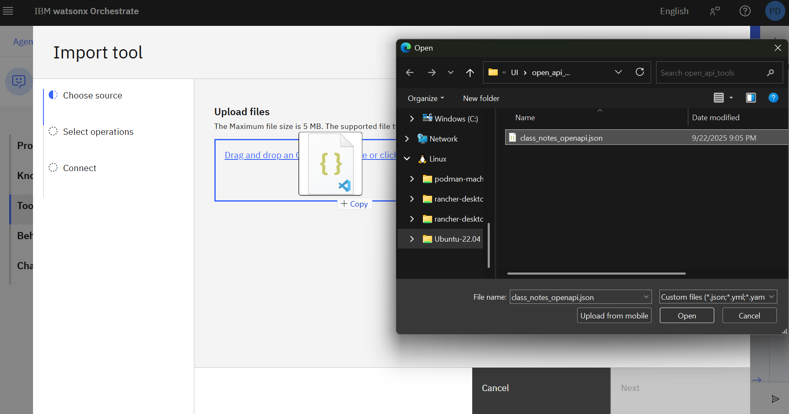

## Step 8: Select Available Tools

Select all the available tools for the classroom behavior monitoring system:

- **View student behavior history**
- **Record student behavior observation** 
- **Send email notification**

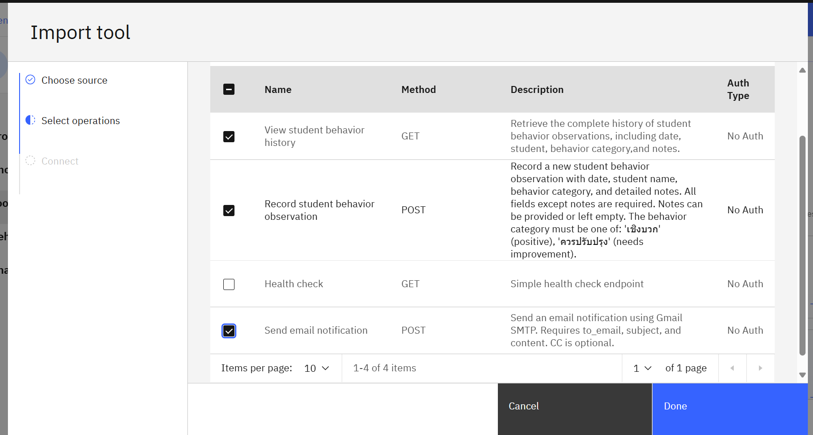

## Step 9: Verify Toolset

The selected tools will now be displayed in the **Toolset** section, ready for use by your agent.

## Step 10: Configure Agent Behavior

1. Navigate to the **"Behavior"** section
2. Add the following instruction to ensure multilingual support:
   ```
   Answer in the same language as user's query.
   ```

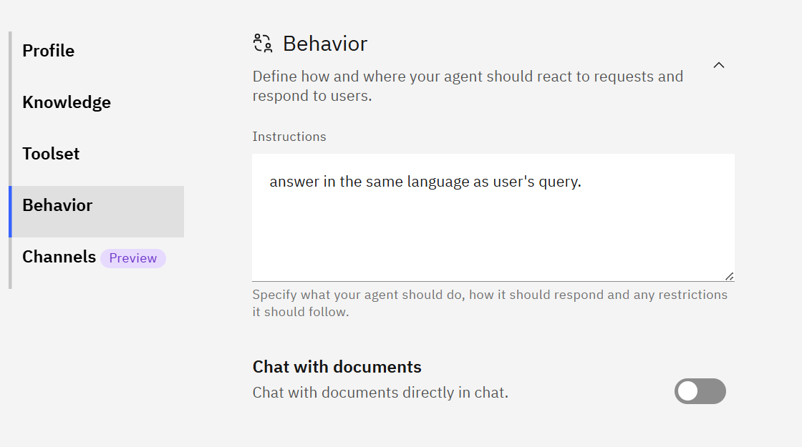

> **Note:** This instruction ensures your agent responds in the same language (Thai, English, etc.) that the user uses when asking questions.

## Step 11: Testing the Agent

### Access Google Sheets Data

You can view the recorded behavior data in this Google Sheet:
[Classroom Behavior Monitoring Sheet](https://docs.google.com/spreadsheets/d/1kH5pafULRdw1rZ2YaRhNLkxZizVrxQDcWa3uIyL9ADw/edit?usp=sharing)

### Test Queries

Test the agent functionality with the following sample queries:

#### 1. Record Positive Behavior
```
วันนี้ <ด.ช./ด.ญ yourname> ได้ช่วยทำความสะอาดห้องเรียน ช่วยบันทึกลงในรายงานความประพฤติให้หน่อย
```


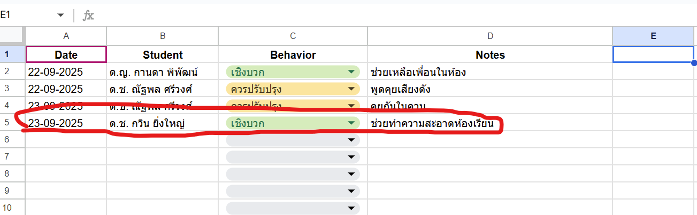

#### 2. Record Behavior That Needs Improvement
```
<ด.ช./ด.ญ yourname> ไม่ทำการบ้าน ช่วยบันทึกให้หน่อย
```

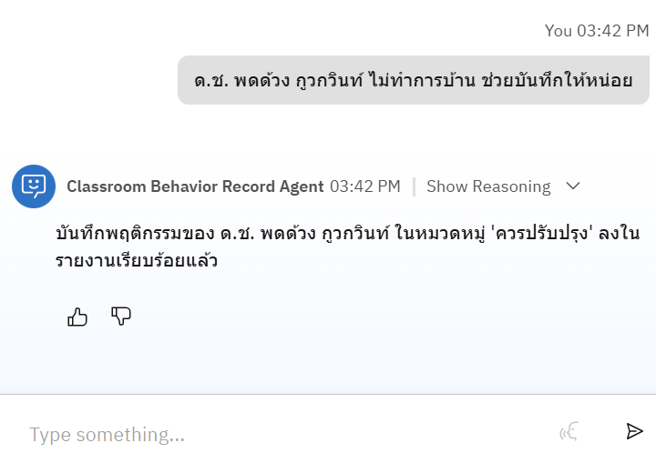

#### 3. Query Student Behavior History
```
ขอรายชื่อนักเรียนทุกคนที่มีพฤติกรรมควรปรับปรุง
```

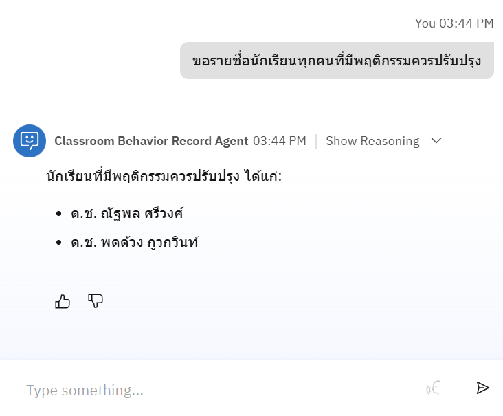

#### 4. Send Email Report
```
ช่วยส่ง email สรุปรายงานความประพฤติ ของวันที่ 23 แบบอ่านง่ายๆ และลงชื่อด้วย โรงเรียนมงฟอร์ตวิทยาลัย ไปที่ <your email address>
```

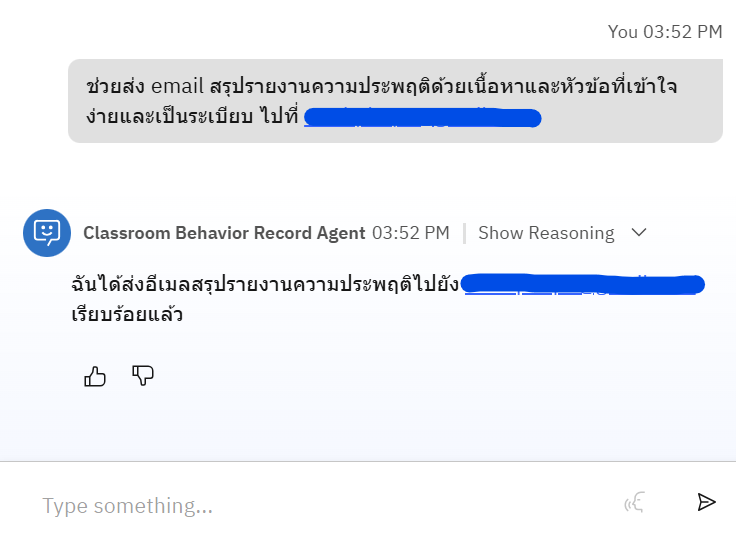

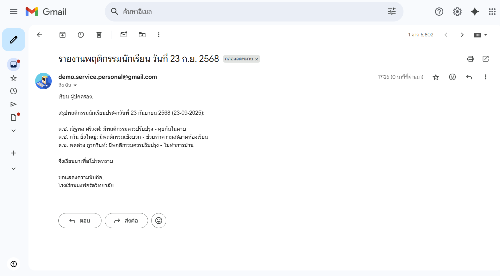
